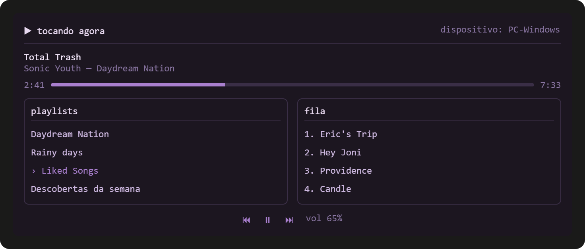
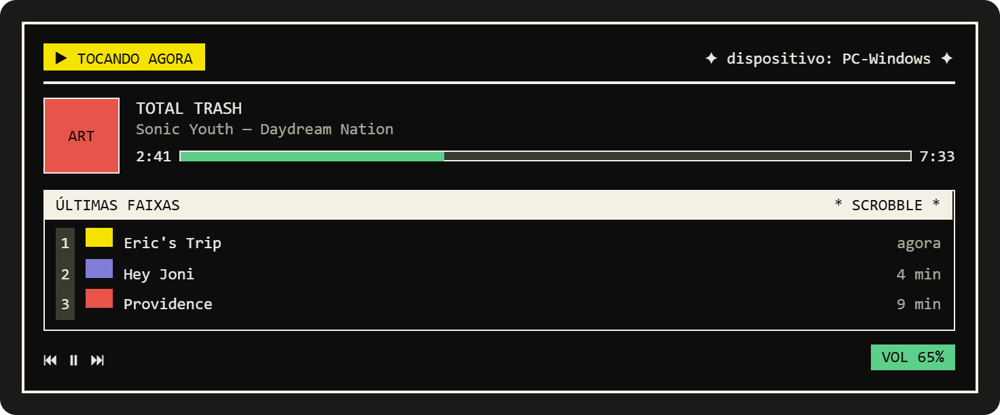

# Riff 🎧

A terminal client (TUI) for controlling your Spotify account, with an interface inspired by classic command-line music players.

This project started from a conversation about [`meloid`](https://github.com/DexerMatters/meloid), a Haskell music player built by a friend for local files on Linux. Riff borrows that same spirit — album panels, track listings, playback queue, text-mode progress bars — and applies it to controlling a Spotify account on Windows.



## What it is and what it's for

Riff **is not** an audio player in the traditional sense. It's a **text-mode remote control** for Spotify: a fast, good-looking terminal interface to see what's playing, browse albums and playlists, manage the queue, and control playback (play/pause/skip/volume/seek) — without opening the heavier official app or a browser tab.



The audio itself is still played by the **official Spotify app** (or any Spotify Connect device signed in to your account) — Riff only sends commands to it through the official API. This means:

- ✅ Your listening history keeps being recorded normally;
- ✅ Your friends still see your recent activity (Friend Activity);
- ✅ Minutes listened still count toward your Spotify Wrapped and end-of-year "time capsule";
- ✅ Everything stays within Spotify's Terms of Service — no reverse engineering, no audio decoding outside the official app.

## How it works (overview)

```
┌──────────────┐       commands (play/pause/next/seek/volume)        ┌────────────────────┐
│     Riff     │ ───────────────────────────────────────────────►    │  Spotify Web API   │
│  (local TUI) │                                                      │   (Player API)     │
└──────────────┘ ◄─────────────────────────────────────────────────   └─────────┬──────────┘
                    current state (track, queue, progress, volume)              │
                                                                                  ▼
                                                                  ┌─────────────────────────┐
                                                                  │ Official Spotify app     │
                                                                  │ (or a Spotify Connect    │
                                                                  │  device)                 │
                                                                  │  → actually decodes and  │
                                                                  │    plays the audio       │
                                                                  └─────────────────────────┘
```

1. Riff authenticates the user via OAuth 2.0 (Authorization Code + PKCE) against Spotify.
2. On each user action (pressing space, an arrow key, etc.), Riff calls the corresponding Web API endpoint (`/me/player/play`, `/me/player/next`, `/me/player/volume`, ...).
3. In parallel, Riff periodically polls the current playback state (`/me/player/currently-playing`, `/me/player/queue`) and updates the screen.
4. The device that actually decodes and plays the sound is always one already authenticated on the account (the official app, open or minimized, or a Connect speaker) — never Riff itself.

## Tech stack and rationale

| Technology | Role | Why |
|---|---|---|
| **Python 3** | Main language | Already familiar to the author; mature ecosystem for HTTP, OAuth, and TUIs |
| **[Textual](https://textual.textualize.io/)** | Terminal UI framework | Modern, actively maintained TUI framework with ready-made widgets (tables, lists, progress bars, dockable panels) that map well to the multi-panel aesthetic this project is going for |
| **[Spotipy](https://spotipy.readthedocs.io/)** | Spotify Web API client | The de facto Python library for the Web API; already handles the OAuth flow (including PKCE) and exposes Player API endpoints in a simple, typed way |
| **Spotify Web API (Player API)** | Actual playback backend | The only **legal, official** way to control playback programmatically without reimplementing audio decoding (see ADR-001) |

Each decision, along with the alternatives that were considered and dropped, is documented in [`ADR.md`](./ADR.md).

## Requirements

- Windows 10/11
- Python 3.11+
- **Spotify Premium** account (required by the Web API's playback control endpoints)
- Official Spotify app (desktop or mobile) installed and signed in — it's the one actually playing the audio
- An app registered on the [Spotify for Developers Dashboard](https://developer.spotify.com/dashboard) (free, Development Mode, personal use)

## Installation

```bash
git clone https://github.com/HenriqueUE/Riff.git
cd Riff
poetry install
```

Set up your Spotify credentials (from the Developer Dashboard) in a `.env` file — you can copy `.env.example` as a starting point:

```bash
copy .env.example .env    # Windows
# cp .env.example .env    # Linux/macOS
```

```
SPOTIFY_CLIENT_ID=your_client_id
SPOTIFY_REDIRECT_URI=http://127.0.0.1:8888/callback
```

Then run:

```bash
poetry run riff
```

On first run, your browser will open asking you to log in/consent on Spotify. After that, the session is saved locally and you won't need to log in again.

## Features

- [x] OAuth 2.0 authentication (Authorization Code + PKCE)
- [x] "Now playing" panel (track, artist, album, progress)
- [x] Playback controls (play/pause/next/previous)
- [ ] Volume control
- [ ] Playback queue (view and reorder)
- [ ] Browsing playlists and saved albums
- [ ] Album cover art rendered in-terminal
- [ ] Dynamic accent color derived from album art
- [ ] Seek control
- [ ] Recent listening history inside the TUI
- [ ] Active device switching (transfer playback between PC/phone/speaker)

## Related projects

- [**meloid**](https://github.com/DexerMatters/meloid) — local music player in Haskell; the direct visual inspiration for this project.
- [**spotify-tui**](https://github.com/Rigellute/spotify-tui) — Rust terminal client using the same remote-control-via-Web-API approach.
- [**ncspot**](https://github.com/hrkfdn/ncspot) — Rust terminal client; mentioned only as a market reference (it uses an unofficial protocol to play audio directly, which is outside this project's scope — see ADR-001).

## License

MIT.

## Disclaimer

This project uses the Spotify Web API under the [Spotify Developer Terms of Service](https://developer.spotify.com/policy). It is not affiliated with, endorsed by, or sponsored by Spotify AB.

## Extras

Visual references and inspiration boards. These might eventually feed into a theming feature — or might not, we'll see.


